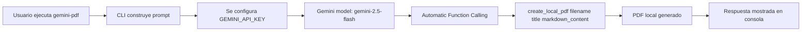

# gemini-tools

Idioma: [English](README.md) | **Español**

Herramienta CLI en Python para generar contenido con Gemini y producir un PDF local usando una función/tool llamada automáticamente por el modelo.

## Resumen

Este proyecto expone el comando `gemini-pdf`, que:

1. Toma un prompt desde la terminal.
2. Envía la petición a Gemini (`gemini-2.5-flash`).
3. Permite que el modelo invoque la función `create_local_pdf(...)` para construir un PDF con ReportLab.
4. Muestra en consola la respuesta del modelo.

## Funcionalidades actuales

- CLI simple: `gemini-pdf "tu petición"`
- Carga de variables de entorno con `.env` (`python-dotenv`)
- Integración con Gemini vía `google-generativeai`
- Generación de PDF local con `reportlab`
- Registro en consola del resultado de Gemini

## Requisitos

- Python 3.9 o superior
- Clave de API de Gemini en la variable `GEMINI_API_KEY`

## Instalación

Desde la raíz del proyecto:

```bash
python -m venv .venv
source .venv/bin/activate
pip install -U pip
pip install -e .
```

Esto instala también el script de consola:

- `gemini-pdf`

## Configuración

1. Crea un archivo `.env` en la raíz del proyecto.
2. Define tu API key:

```env
GEMINI_API_KEY=tu_api_key_aqui
```

También puedes exportarla directamente en el entorno:

```bash
export GEMINI_API_KEY="tu_api_key_aqui"
```

## Uso

### Modo directo

```bash
gemini-pdf "Genera un PDF con un resumen de tendencias de IA en 2026 con secciones y puntos clave"
```

### Modo interactivo

Si ejecutas el comando sin argumentos, la CLI pedirá la petición:

```bash
gemini-pdf
```

Salida esperada (aprox.):

```text
Uso: gemini-pdf "Descripción del PDF que deseas generar"
Petición: ...
🤖 Procesando solicitud con Gemini...

✨ Respuesta de Gemini:
...
```

## Cómo funciona internamente

- Punto de entrada CLI: `src/gemini_tools/cli.py`
- Generador PDF y llamada al modelo: `src/gemini_tools/pdf_generator.py`
- Script definido en `pyproject.toml`:
  - `gemini-pdf = "gemini_tools.cli:main"`

Flujo simplificado:



## Estructura del proyecto

```text
src/
  gemini_tools/
    __init__.py
    cli.py
    pdf_generator.py
pyproject.toml
README.md
README.es.md
```

## Dependencias principales

- `google-generativeai>=0.8.0`
- `reportlab>=4.0.0`
- `python-dotenv>=1.0.0`

## Limitaciones conocidas

- La creación efectiva del PDF depende de que Gemini decida invocar la función `create_local_pdf`.
- El formateo tipo Markdown es básico (conversión parcial de `**negrita**`), no es un parser completo.
- Actualmente no hay pruebas automatizadas incluidas.

## Troubleshooting

### Error: `No se encontró GEMINI_API_KEY`

- Verifica que el archivo `.env` exista y tenga `GEMINI_API_KEY=...`.
- Si usas variable del sistema, confirma con `echo $GEMINI_API_KEY`.

### El comando `gemini-pdf` no existe

- Asegura instalación editable con `pip install -e .` dentro del entorno virtual activo.
- Reabre la terminal o reactiva el venv.

### No se genera PDF

- Revisa la respuesta del modelo en consola.
- Prueba con un prompt más explícito, por ejemplo: pedir directamente que use la herramienta para crear un PDF con nombre, título y contenido.

## Desarrollo

Instalación para desarrollo:

```bash
python -m venv .venv
source .venv/bin/activate
pip install -U pip
pip install -e .
```

Ejecución local del módulo (alternativa):

```bash
python -m gemini_tools.cli "Genera un PDF con un plan semanal de estudio"
```
