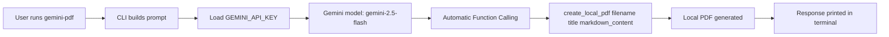

# gemini-tools

Language: **English** | [Español](README.es.md)

Python CLI tool that generates content with Gemini and creates a local PDF through an automatic function/tool call.

## Overview

This project exposes the `gemini-pdf` command, which:

1. Reads a prompt from the terminal.
2. Sends it to Gemini (`gemini-2.5-flash`).
3. Lets the model call `create_local_pdf(...)` to build a local PDF with ReportLab.
4. Prints Gemini's response in the terminal.

## Current Features

- Simple CLI: `gemini-pdf "your prompt"`
- Environment loading from `.env` (`python-dotenv`)
- Gemini integration via `google-generativeai`
- Local PDF generation with `reportlab`
- Terminal output with model response

## Requirements

- Python 3.9+
- Gemini API key available in `GEMINI_API_KEY`

## Installation

From the project root:

```bash
python -m venv .venv
source .venv/bin/activate
pip install -U pip
pip install -e .
```

This also installs the console command:

- `gemini-pdf`

## Configuration

1. Create a `.env` file in the project root.
2. Add your API key:

```env
GEMINI_API_KEY=your_api_key_here
```

Or export it in your shell:

```bash
export GEMINI_API_KEY="your_api_key_here"
```

## Usage

### Direct mode

```bash
gemini-pdf "Create a PDF with a 2026 AI trends summary, sections, and key takeaways"
```

### Interactive mode

If you run the command without arguments, it will ask for a prompt:

```bash
gemini-pdf
```

Expected output (approx.):

```text
Usage: gemini-pdf "Description of the PDF you want to generate"
Prompt: ...
Processing request with Gemini...

Gemini response:
...
```

## Internal Flow

- CLI entry point: `src/gemini_tools/cli.py`
- PDF generator and model call: `src/gemini_tools/pdf_generator.py`
- Script entry in `pyproject.toml`:
  - `gemini-pdf = "gemini_tools.cli:main"`

Simplified flow:



## Project Structure

```text
src/
  gemini_tools/
    __init__.py
    cli.py
    pdf_generator.py
pyproject.toml
README.md
README.es.md
```

## Main Dependencies

- `google-generativeai>=0.8.0`
- `reportlab>=4.0.0`
- `python-dotenv>=1.0.0`

## Known Limitations

- PDF creation depends on Gemini deciding to call `create_local_pdf`.
- Markdown formatting is basic (partial `**bold**` conversion), not a full Markdown parser.
- No automated tests are included yet.

## Troubleshooting

### Error: missing `GEMINI_API_KEY`

- Make sure `.env` exists and contains `GEMINI_API_KEY=...`.
- If using shell variables, verify with `echo $GEMINI_API_KEY`.

### `gemini-pdf` command not found

- Ensure editable install is done inside an active virtual environment: `pip install -e .`
- Reopen your terminal or reactivate the venv.

### PDF is not generated

- Check the model response in the terminal.
- Try a more explicit prompt asking the model to use the PDF creation tool with filename, title, and content.

## Development

Development setup:

```bash
python -m venv .venv
source .venv/bin/activate
pip install -U pip
pip install -e .
```

Run locally as a module (alternative):

```bash
python -m gemini_tools.cli "Generate a PDF with a weekly study plan"
```
